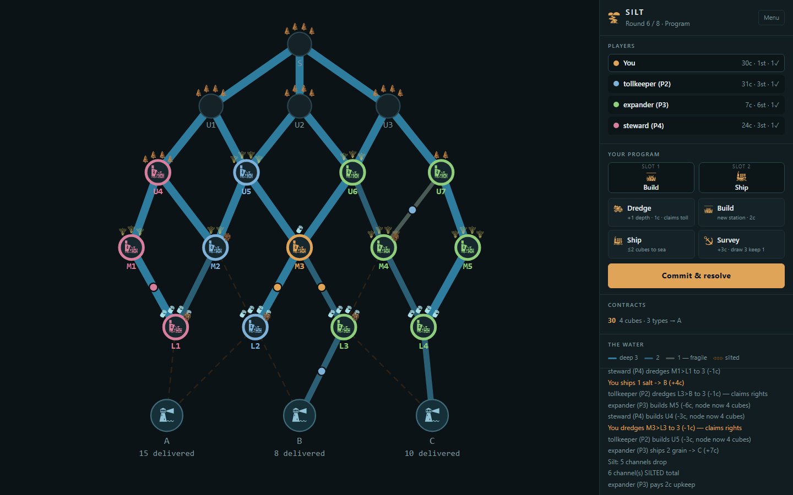

# SILT

A river-delta euro board game. 2–4 players, ~60–75 min.

**The pitch:** your shipping lanes are also the thing your shipping destroys. Every good you move down a channel silts it one step closer to dead. The delta stays navigable only if players collectively pay to dredge it — and any player who defects to pure profit rides free on everyone else's maintenance.

No hidden information. No take-that cards. You lose because you misread the board, not because someone ambushed you.

---

## Play it

```bash
npm install
npm run play      # opens at localhost:5178
```

Pick your table from the menu — 2–4 players, each opponent set to one of six AI
archetypes, and a 5/8/11-round length.

Three ways in, depending on how you like to learn:

- **Guided first game** — walks you through the rules step by step, waiting on
  real actions rather than just showing text.
- **Watch** — the bots play a full game while it is explained. Opens by teaching
  the goal and the four actions on a still board, then narrates what happens.
  A **Voice** button reads the captions aloud using whatever speech voices your
  OS has; it is off by default and remembered.
- **Rules** — the reference, with figures drawn using the board's own geometry.

Hover anything you do not recognise. Every node, channel, action and contract
explains itself.

---

## The rules

### What things are called

The code and the interface do not use the same words, which is worth knowing
before reading either. The right-hand column is what a player actually sees.

| In the code | On screen | What it is |
|---|---|---|
| `cubes` | goods | Timber, grain or salt sitting on a node |
| `station` | settlement | A site you own, which produces goods each round |
| `mouth` | bay | Where the river meets the sea. Goods score here |
| `rights` | claim / toll | Dredge a channel and you own it; others pay to pass |
| `depth` | depth | 3 → 2 → 1 → dead. Dead is permanent |

There are no physical cubes — the word is board-game shorthand for a unit of
goods and it survives only in variable names.

### Round structure

1. **Program** — choose 2 of the 4 actions, in order. Everyone simultaneously.
2. **Reveal** — all programs flip. Locked, no aborts.
3. **Resolve slot 1** in seat order, then **slot 2**.
4. **Silt** — every channel that carried cargo this round drops 1 depth. Max 1 per channel per round.
5. **Regrow** — settlements produce, and the emptiest unclaimed node recovers one good.
6. **Upkeep** — pay 1 gold per settlement beyond your first 4. Cannot pay? You abandon one.

Eight rounds.

### Actions

| Action | Effect |
|---|---|
| **Dredge** | +1 depth to one channel. Costs 1 gold, and claims it — others then pay you a toll to pass. Cannot revive a dead channel. |
| **Build** | Settlement on an empty adjacent node. Costs 1 gold + 1 per settlement owned. Arrives with 2 goods. |
| **Ship** | Move ≤2 goods from one of your settlements to a bay. Pays 2 gold/good + 1 per channel crossed. |
| **Survey** | +3 gold, draw 3 contracts keep 1. |

Channels run 3 → 2 → 1 → **SILTED**. Depth 1 is still navigable; SILTED is gone permanently.

### Scoring

- **Contracts** — 10 / 18 / 30 VP (local / regional / delta). The deck stores
  5/9/15 and `TUNING.contractScale` doubles them; the UI shows the doubled value,
  so that is the number quoted here.
- **Bay majority** — 12 / 6 / 2 VP per bay by goods delivered, ties shared
- **Live network** — 2 VP per settlement still reaching the sea at depth ≥2
- **Coins** — 1 VP per 5
- **Silt penalty** — −1 VP per dead channel touching your settlements

Settlements score **nothing** on their own. Only working routes count.

---

## Repo layout

**Rules** — no DOM, no rendering. `sim.mjs` plays 200 games a second because of this.

| File | What it is |
|---|---|
| `graph.js` | Delta topology — 20 nodes, 31 channels, 3 bays |
| `engine.js` | Pure rules engine. All tuning constants live in `TUNING` |
| `ai.js` | Six bot archetypes used to stress the balance |

**Presentation** — may read game state, never changes it.

| File | What it is |
|---|---|
| `index.html` / `ui.js` | Browser prototype (SVG, no build step) |
| `board.js` | Board renderer. Takes a ctx, reads no globals |
| `panel.js` | Sidebar and action bar rendering |
| `fx.js` | Effects overlay — what you watch during resolution |
| `panzoom.js` | Pan/zoom via SVG viewBox. Game-agnostic |
| `tips.js` | Delegated hover help (`data-tip`) |
| `theme.js` | Vocabulary and palette. SILT (English) / ANOD (Tagalog) |

**Teaching** — three routes in, for three kinds of person.

| File | What it is |
|---|---|
| `tutorial.js` | Guided first game, gated on real game state |
| `rulebook.js` / `diagrams.js` | Reference pages, figures drawn with the board's own curves |
| `demo.js` | Watch mode: a real game the bots play while it is narrated |
| `narration.js` | What the demo says and when — the script, not the projector |
| `speech.js` | Optional read-aloud via the browser's speechSynthesis |

**Tooling**

| File | What it is |
|---|---|
| `engine.test.js` | 106 unit tests, including module-boundary and line-cap guards |
| `e2e/game.spec.js` | Rules and board Playwright tests |
| `e2e/ui.spec.js` | Menu, tutorial, assets, responsiveness |
| `e2e/demo.spec.js` | Watch mode, narration and speech |
| `sim.mjs` | Headless balance simulator |
| `analyze.mjs` | Topology analysis — chokepoints, route counts |
| `gen-assets.mjs` / `prep-art.mjs` / `pick-tiles.mjs` | Art generation and scoring |
| `assets/` | Icon sprite sheet + credits (`build-sprites.mjs` regenerates) |

See `ARCHITECTURE.md` before adding a module — the boundaries above are enforced
by tests, not convention.

```bash
npm test          # unit
npm run e2e       # browser
npm run sim       # 400-game balance report
npm run analyze   # map topology
```

---

## Design notes

The bot archetypes exist to answer specific balance questions:

- **defector** never dredges → is freeloading on the commons profitable?
- **steward** over-maintains → is maintenance a sucker's bet?
- **expander** builds relentlessly → is escalating build cost a real brake?
- **turtle** sits on 3 settlements near a bay → can you win by ignoring the map?

Current results (400 games each, competent fields): heads-up is 51/49, the 4-way mirror sits at 26%, and `defector` collapses to 0.8–6% — freeloading loses. `expander` only dominates when its opponents are deliberately crippled bots.

### Balance

Measured over 400 games per field, both seat orders:

| Field | Win rates | Avg score |
|---|---|---|
| 2p | 47 / 53 | 45–47 |
| 3p | 32 / 32 / 39 | 42–46 |
| 4p mixed | ~25 each | ~40 |

Contracts are 37–46% of a winning score, ~9 of 31 channels silt per game, and
about 55% of settlements still reach the sea at the end.

**Dredging Rights** is what made maintenance a real strategy: dredging claims the
channel, others pay a toll to ship through it, and channels you still hold at
depth 2+ score at game end. Without it every archetype converged on the same line.

Rejected after measurement, kept as `TUNING` flags so the results are reproducible:

- `siltDownstream` — severs the delta; 0% of settlements end up live
- `siltPerShip: 2` — hits the silt target but collapses scores to 17
- snake resolution order — no measurable effect on seat balance

### Known open issues

- `turtle` still wins ~45% in the all-comers field; it is the strongest single line.
- Scores land at 40–47 against an original 45–60 target — close, not centred.

### Tuning

Everything is in `TUNING` at the top of `engine.js`. Change a value, run `npm run sim`, read the win rates. The simulator is the point — it turns "I think dredging is too strong" into a number in about four seconds.



## Credits

Icons from [game-icons.net](https://game-icons.net) by Lorc and Delapouite, CC BY 3.0.
See [assets/CREDITS.md](assets/CREDITS.md).
